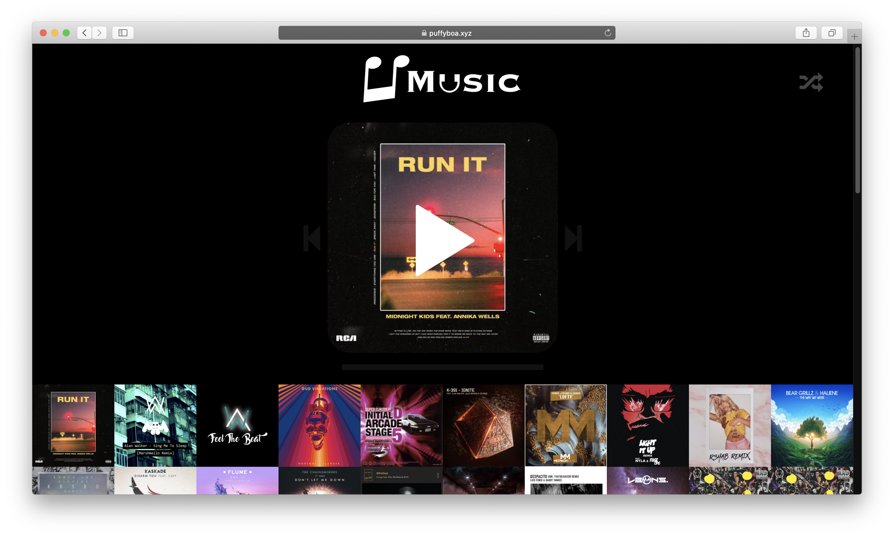

# uMusic
Ad-free music streaming platform that scrapes and tags songs from top charts on SoundCloud

## Installation
Installation is pretty simple. Clone the repo, then install python dependencies with pip:

`pip install -r requirements.txt`

### Configuration

The following vars need to be put in a config.py file inside an instance dir in the root of the repo dir.

 - SOUNDCLOUD_CLIENT_ID: A client key for the SoundCloud API. It is required to scrape the songs.

 - SENTRY_DSN: A DSN for Sentry. If provided, Sentry error reporting is setup.

An example would look like this

```python
# A client key for the SoundCloud API. It is required to scrape the songs.
SOUNDCLOUD_CLIENT_ID = "YUKXoArFcqrlQn9tfNHvvyfnDISj04zk"

# A DSN for sentry. If provided, sentry error reporting is set up.
SENTRY_DSN = "123123@sentry.io/32423432"
```

## Commands

### ```init```

After setting up the FLASK_APP, you can initialize the database using flask:

```
flask init
```

or directly by using python:

```
python -m app.cli init
```

This will create the SQLite3 database to store tracks, artists, and albums.

### ```scrape```

Scrape tracks and add them to the database with the following sample command:

```
flask scrape --genre danceedm 100
```

or

```
python -m app.cli scrape --genre danceedm 100
```

This will scrape the top 100 tracks in the SoundCloud "danceedm" genre and insert them into the database.

List of available genres:
 - all-music
 - all-audio
 - alternativerock
 - ambient
 - classical
 - country
 - danceedm
 - dancehall
 - deephouse
 - disco
 - drumbass
 - dubstep
 - electronic
 - folksingersongwriter
 - hiphoprap
 - house
 - indie
 - jazzblues
 - latin
 - metal
 - piano
 - pop
 - rbsoul
 - reggae
 - reggaeton
 - rock
 - soundtrack
 - techno
 - trance
 - trap
 - triphop
 - world
 - audiobooks
 - business
 - comedy
 - entertainment
 - learning
 - newspolitics
 - religionspirituality
 - science
 - sports
 - storytelling
 - technology

(from [this StackOverflow question](https://stackoverflow.com/questions/35688367/access-soundcloud-charts-with-api))

## Website



Once the server is up and running, this is what users see.

